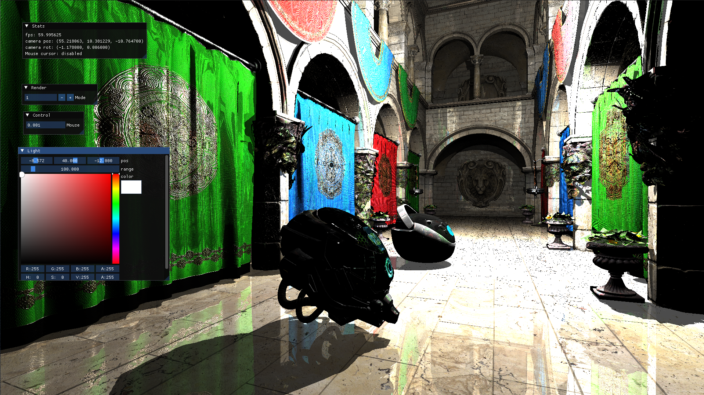

# Vulkan Rendering
Real-time rendering playground using C++ and Vulkan.

## Description


You can control camera with
- W/A/S/D: forward/left/backward/right
- E/Q: up/down
- mouse: direction
  - right-click to enable/disable mouse control (**disabled** in default)

## Steps
### 1. Create docker image
```shell
sh docker/build.sh
```

### 2. Shader compile
```shell
# to compile updated shaders only
sh run.sh sc

# to compile all shaders
sh run.sh sc-all
```
Compiled shaders are located in `./processed/spv/`.

### 3. Compile and Run
```shell 
# compile
mkdir build && cd build
cmake ../
make

# run
/path/to/vlux
```
or you can just use VSCode to launch.

## TODO
- [x] Mouse control
- [x] Compute shader
- [x] Deferred rendering
  - [x] Multi render targets 
  - [x] Lighting (Blinn Phong)
- [x] Gamma correction
- [ ] Cubemap
- [ ] Screen space ambient occlusion
- [ ] Transparent pass
- [ ] Use config file
- [ ] Reflection
- [ ] Cubemap
- [ ] Reflection
- [ ] Shadow
- [ ] LOD
- [ ] Displacement mapping
- [ ] Raytracing
- [ ] Mesh shader
- [ ] Multi-threading
